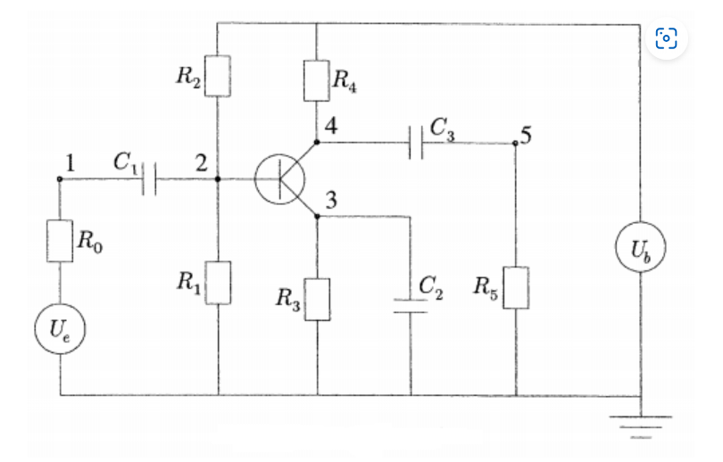

Advanced Engineering Applications
=================================

In this chapter we present pratical engineering problems solved with combinations of concept discussed under linear algebra, optimization, ordinary differential equations, numerical laplace inversion and special functions

Dimensionless Water Influx Estimation
-------------------------------------

Specific Heat Capacity of Natural Gas
-------------------------------------

Compressibility of Natural Gas
------------------------------

Howarth's Transformation
------------------------

Pleiades System
---------------
The Pleiades problem is a celestial mechanics problem describing the gravitational interactions of seven stars [1]. This cluster of stars is also referred to as The Seven Sisters, and it is visible to the human eye in the night sky due to its proximity to Earth [2]. The system of equations describing the motion of the stars in the cluster consists of 14 nonstiff second-order differential equations, which produce a system of 28 equations when rewritten in first-order form.

Baton Mechanics
---------------

One Transistor Amplifier
------------------------
This example shows how to solve a stiff differential algebraic equation (DAE) that describes an electrical circuit. The one-transistor amplifier problem can be rewritten in semi-explicit form, but this example solves it in its original form :math:`Mu=\varphi(u)` The problem includes a constant, singular mass matrix :math:`M`.

The transistor amplifier circuit contains six resistors, three capacitors, and a transistor.

- The initial voltage signal is :math:`U_e(t) = 0.4\sin(200\pi t)`.
- The operating voltage is :math:`U_b = 6`.
- The voltages at the nodes are given by :math:`U_i(t) (i = 1,2,3,4,5)`.
- The values of the resistors  :math:`R_i(t) (i = 1,2,3,4,5)`. are constant, and the current through each resistor satisfies :math:`I = U/R`.
- The values of the capacitors :math:`C_i (i = 1,2,3)` are constant, and the current through each capacitor satisfies :math:`I=C⋅dU/dt`.

The goal is to solve for the output voltage through node 5, :math:`U_5(t)`.

.. tabs::

   .. tab:: CCL-Math
      CCL-Math Implementation

      .. code-block:: C#
         
         // import libraries
         using CypherCrescent.MathematicsLibrary;
         using static MathsChart.Chart;

         double pi = PI, Ub = 6, R0 = 1000, R15 = 9000, alpha = 0.99,
         beta = 1e-6, Uf = 0.026, c1 = 1e-6, c2 = 2e-6, c3 = 3e-6;
         Matrix Mass(double t, ColVec y) =>
            new double[,] { {-c1,  c1,  0,   0,   0 },
                            { c1, -c1,  0,   0,   0 },
                            { 0,   0,  -c2,  0,   0 },
                            { 0,   0,   0,  -c3,  c3},
                            { 0,   0,   0,   c3, -c3} };
        
        ColVec dudt(double t, ColVec u)
        {
            double Ue = 0.4 * Sin(200 * pi * t),
                   f23 = beta * (Exp((u[1] - u[2]) / Uf) - 1);
            double[] du = [ -(Ue - u[0])/R0,
                          -(Ub/R15 - u[1]*2/R15 - (1-alpha)*f23),
                          -(f23 - u[2]/R15),
                          -((Ub - u[3])/R15 - alpha*f23),
                           u[4]/R15 ];
            return du;
        }
        double[] tspan = [0, 0.1];
        double[] y0 = [0, Ub / 2, Ub / 2, Ub, 0];
        
        Ode.Set options = new() { RelTol = 1e-3, MassType = Ode.MassType.Constant };
        
        var TY = Ode.Dae45(dudt, Mass, y0, tspan, options);
        ColVec X = TY.X, U5 = TY.Y["", 4];
        var plt = Scatter(X, 0.4 * Maths.Sin(200 * pi * X), "o");
        plt.AddPlot(X, U5, "--r");
        plt.Legend = new()
        {
            labels = ["Input", "Output"],
            alignment = "upperleft"
        };
        plt.XLabel = "Time t";
        plt.YLabel = "Solution y";
        plt.Title = "One Transistor Amplifier DAE Problem-DAE45";
        plt.SaveFig("One Transistor Amplifier DAE Problem-DAE45.png");
        plt.Show();
        

      .. figure:: images/One-Transistor-Amplifier-DAE-Problem-CCL-Math-DAE45.png
         :align: center
         :alt: One-Transistor-Amplifier-DAE-Problem-CCL-Math-DAE45.png
     

   .. tab:: Python

      Python Implementation

      .. code-block:: python

      

   .. tab:: Matlab

      Matlab Implementation

      .. code-block:: matlab

         % define the function handle
         Ub = 6; R0 = 1000; R15 = 9000; alpha = 0.99; beta = 1e-6; 
         Uf = 0.026; c1 = 1e-6; c2 = 2e-6; c3 = 3e-6;
         M = [-c1,  c1,   0,   0,   0
               c1, -c1,   0,   0,   0
                0,   0, -c2,   0,   0
                0,   0,   0, -c3,  c3
                0,   0,   0,  c3, -c3];
        
         Ue = @(t) 0.4 * sin(200 * pi * t);
         f23 = @(u) beta * (exp((u(2) - u(3)) / Uf) - 1);
         dudt = @(t, u)[-(Ue(t) - u(1))/R0
                        -(Ub/R15 - u(2)*2/R15 - (1-alpha)*f23(u))
                        -(f23(u) - u(3)/R15)
                        -((Ub - u(4))/R15 - alpha*f23(u))
                        u(5)/R15];
         % set initial condition
         u0 = [0, Ub / 2, Ub / 2, Ub, 0];
         
         % set time span
         t_span = [0, 0.1];
         
         % call the solver
         options = odeset(Mass = M);
         [t, u] = ode23t(dudt, t_span, u0, options);
         
         % display the result
         plot(t, Ue(t), 'bo', t, u(:,5), '.r');
         xlabel('t')
         ylabel('y')
         legend("Input Voltage U_e(t)","Output Voltage U_5(t)",Location="NorthWest");
         title("One Transistor Amplifier DAE Problem-Matlab-ODE23T");
         saveas(gcf, 'One-Transistor-Amplifier-DAE-Problem-Matlab-ODE23T', 'png')

      .. figure:: images/One-Transistor-Amplifier-DAE-Problem-Matlab-ODE23T.png
         :align: center
         :alt: One-Transistor-Amplifier-DAE-Problem-Matlab-ODE23T.png

Reference
---------

1. Hairer, E., et al. Solving Ordinary Differential Equations I: Nonstiff Problems. 2nd rev. ed, Springer, 2009.

2. “Pleiades.” Wikipedia, 21 June 2021. Wikipedia, https://en.wikipedia.org/wiki/Pleiades.

3. “Pleiades.” Wikipedia, 21 June 2021. Wikipedia, https://en.wikipedia.org/wiki/Pleiades.