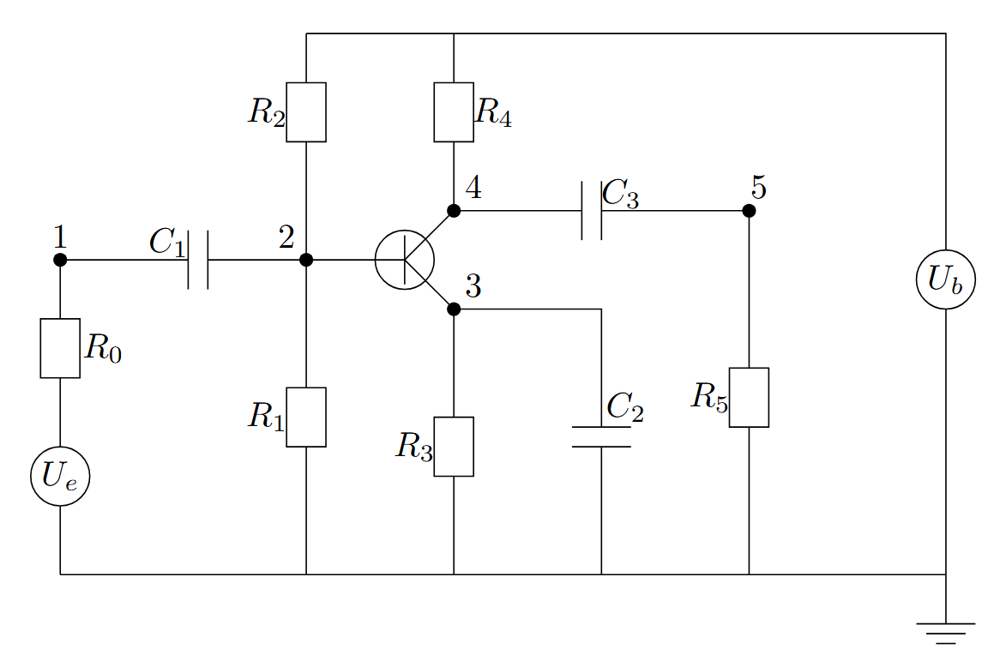

Advanced Engineering Applications
=================================

In this chapter we present pratical engineering problems solved with combinations of concept discussed under linear algebra, optimization, ordinary differential equations, numerical laplace inversion and special functions

Dimensionless Water Influx Estimation
-------------------------------------

Specific Heat Capacity of Natural Gas
-------------------------------------

Compressibility of Natural Gas
------------------------------

Howarth's Transformation
------------------------

Pleiades System
---------------
The Pleiades, also known as the Seven Sisters (M45)[1], is a prominent open star cluster located in the constellation Taurus. It's one of the closest and most easily visible star clusters to Earth[2], making it a favorite target for stargazers and a subject of fascination across cultures. The system of equations describing the motion of the stars in the cluster consists of 14 nonstiff second-order differential equations, which produce a system of 28 equations when rewritten in first-order form.

Celestial mechanics is basically an interplay between Newton's law of gravitation :math:`F_i = \sum_{i \neq j} g \cfrac{m_i m_j}{||p_j - p_i||^2}d_{ij}` and Newton's second law of motion :math:`F_i = m_i\cfrac{d^2p_i}{dt^2}`. 

The positions determine the gravitational forces acting on the bodies, but the net force on each of the bodies determines its acceleration (i.e. changes its position from the second order).

we examine this system in 2D, i.e. :math:`p_i = [x_i, y_i]`,  :math:`d_{ij} = \cfrac{(p_j - p_i)}{r_{ij}}` and :math:`r_{ij} = ||p_j - p_i||`

The dynamics of the system can then be modelled as:

 .. math:: \cfrac{d^2p_i}{dt^2} = \sum_{i \neq j} g \cfrac{m_j(p_j - p_i)}{r_{ij}^3}

.. tabs::

   .. tab:: CCL-Math
      CCL-Math Implementation

      .. code-block:: C#
         
         // import libraries
         using CypherCrescent.MathematicsLibrary;
         using static MathsChart.Chart;

         // define masses
         double[] m = [1, 2, 3, 4, 5, 6, 7];

         // define function
         ColVec pleiades(double t, ColVec q)
         {
             double[] dqdt = new double[28];
             double x1, x2, y1, y2, dx, dy, r3;
             for (int i = 0; i < 7; i++)
             {
                 // x- velocity of star i
                 dqdt[i + 0] = q[i + 14];
                 // y- velocity of star j
                 dqdt[i + 7] = q[i + 21]; 
                 x1 = q[i]; y1 = q[i + 7];
                 for (int j = 0; j < 7; j++)
                 {
                     x2 = q[j]; y2 = q[j + 7];
                     if (j != i)// The star does not attract itself
                     {
                         dx = x2 - x1; dy = y2 - y1;
                         r3 = Pow(dx * dx + dy * dy, 1.5);
                         //impact of star j on x-acceleration of star i 
                         dqdt[i + 14] += m[j] * dx / r3;
                         //impact of star j on y-acceleration of star i 
                         dqdt[i + 21] += m[j] * dy / r3;
                     }
                 }
             }
             return dqdt;
         }
        
         double[] init = [3, 3,-1, -3, 2, -2, 2, 
                          3, -3, 2, 0, 0, -4, 4,
                          0, 0, 0, 0, 0, 1.75, -1.5,
                          0, 0, 0, -1.25, 1, 0, 0];
        
         Indexer I = new(0, 7), J = I + 7;
         double[] tspan = [..ColVec.Linspace(1, 15, 200)];
         var opts = new Ode.Set() {AbsTol = 1e-15, RelTol = 1e-13};
        
         Ode.Result result89 = Ode.Ode89(pleiades, 
             init, tspan, opts);
         var plt = Plot(result89.Y["", I], result89.Y["", J], "--");
         plt.Title = "Position of Pleiades Stars, Solved by ODE89";
         plt.XLabel = "X Position";
         plt.YLabel = "y Position";
         plt.SaveFig("Position-of-Pleiades-Stars-CCL-Math-Ode89.png");
        

      .. figure:: images/Position-of-Pleiades-Stars-CCL-Math-Ode89.png
         :align: center
         :alt: Position-of-Pleiades-Stars-CCL-Math-Ode89.png

   .. tab:: Python

      Python Implementation

      .. code-block:: python

      

   .. tab:: Matlab

      Matlab Implementation

      .. code-block:: matlab

         % define the function handle
         dqdt = @(t, q) pleiades(t,q);

         % set initial condition
         q0 = [3 3 -1 -3 2 -2 2 ...
               3 -3 2 0 0 -4 4 ...
               0 0 0 0 0 1.75 -1.5 ...
               0 0 0 -1.25 1 0 0]';
         
         % set time span
         t_span = linspace(1,15,200);
         
         % call the solver
         opts = odeset("RelTol",1e-13,"AbsTol",1e-15);
         [t, q89] = ode89(dqdt, t_span, q0, opts);
         
         % display the result
         plot(q89(:,1:7),q89(:,8:14),'--')
         title('Position of Pleiades Stars, Solved by ODE89')
         xlabel('X Position')
         ylabel('Y Position')
         saveas(gcf, 'Position-of-Pleiades-Stars-Matlab-ODE89', 'png')

         function dqdt = pleiades(t,q)
            x = q(1:7);
            y = q(8:14);
            xDist = (x - x.');
            yDist = (y - y.');
            r = (xDist.^2+yDist.^2).^(3/2);
            m = (1:7)';
            dqdt = [q(15:28);
                    sum(xDist.*m./r,1,'omitnan').';
                    sum(yDist.*m./r,1,'omitnan').'];
          end

      .. figure:: images/Position-of-Pleiades-Stars-Matlab-ODE89.png
         :align: center
         :alt: Position-of-Pleiades-Stars-Matlab-ODE89.png

we can add animation of the solution

.. tabs::

   .. tab:: CCL-Math
      CCL-Math Implementation

      .. code-block:: C#
         
         // import libraries
         using CypherCrescent.MathematicsLibrary;
         using static MathsChart.Chart;

         
         for (int i = 0; i < 200; i++)
         {
             plt = Plot(result89.Y["", I], result89.Y["", J], "--");
             for (int j = 0; j < 7; j++)
                 plt.AddScatter(result89.Y[i, j], 
                     result89.Y[i, j + 7], "fo", 20);
             plt.SaveFig("gif_"+i+".png", 700, 700);
         }
         Animation.Make(i=> Image.FromFile("gif_" + i + ".png"),
                 "Position-of-Pleiades-Stars-CCL-Math-Ode89.gif", 10, 200);
        

      .. figure:: images/Position-of-Pleiades-Stars-CCL-Math-Ode89.gif
         :align: center
         :alt: Position-of-Pleiades-Stars-CCL-Math-Ode89.gif

   .. tab:: Python

      Python Implementation

      .. code-block:: python

      

   .. tab:: Matlab

      Matlab Implementation

      .. code-block:: matlab

         % generate animation
         AnimateOrbits(t89,q89);

         function AnimateOrbits(t,q)
            sz = 15; clrs = 'rkbmcyg';
            for k = 1:length(t)
                plot(q(:,1:7),q(:,8:14),'--'); hold on
                xlim([-20 20]);  ylim([-10 10]);
                arrayfun(@(i) plot(q(k,i), q(k,i+7),'o','MarkerSize',sz,...
                         'MarkerFaceColor',clrs(i)), 1:7);
                hold off
                drawnow
                M(k) = getframe(gca);
                im{k} = frame2im(M(k));
            end
            
            filename = "orbits.gif";
            for idx = 1:length(im)
                [A,map] = rgb2ind(im{idx},256);
                if idx == 1
                    imwrite(A,map,filename,'gif','LoopCount',Inf,'DelayTime',0);
                else
                    imwrite(A,map,filename,'gif','WriteMode','append','DelayTime',0);
                end
            end
            close all
         end

      .. figure:: images/Position-of-Pleiades-Stars-Matlab-ODE89.gif
         :align: center
         :alt: Position-of-Pleiades-Stars-Matlab-ODE89.gif

Baton Mechanics
---------------

One Transistor Amplifier
------------------------
This example shows how to solve a stiff differential algebraic equation (DAE) that describes an electrical circuit. The one-transistor amplifier problem can be rewritten in semi-explicit form, but this example solves it in its original form :math:`Mu=\varphi(u)` The problem includes a constant, singular mass matrix :math:`M`.

The transistor amplifier circuit contains six resistors, three capacitors, and a transistor.

- The initial voltage signal is :math:`U_e(t) = 0.4\sin(200\pi t)`.
- The operating voltage is :math:`U_b = 6`.
- The voltages at the nodes are given by :math:`U_i(t) (i = 1,2,3,4,5)`.
- The values of the resistors  :math:`R_i(t) (i = 1,2,3,4,5)`. are constant, and the current through each resistor satisfies :math:`I = U/R`.
- The values of the capacitors :math:`C_i (i = 1,2,3)` are constant, and the current through each capacitor satisfies :math:`I=C⋅dU/dt`.

The goal is to solve for the output voltage through node 5, :math:`U_5(t)`.

Using Kirchoff's law to equalize the current through each node (1 through 5), you can obtain a system of five equations describing the circuit:

Node 1 :math:`C_1(U'_2 - U'_1) = (U_1 - U_e(t))/R_0`

Node 2 :math:`C_1(U'_1 - U'_2) = (U_2 - U_b)/R_1 + U_2/R_1 + 0.01f(U_2 - U_3)`

Node 3 :math:`-C_2U'_3 = U_3/R_3 - f(U_2 - U_3)`

Node 4 :math:`C_3(U'_5 - U'_4) = (U_4 - U_b)/R_4 + 0.99f(U_2 - U_3)`

Node 5 :math:`C_3(U'_4 - U'_5) = -U_5/R_5`

By extracting the coeeficients of the derivatives into a matrix, we have:
.. math::

   \begin{pmatrix}
   -c_{1}  &  c_{1} &    0   &    0   &   0    \\
    c_{1}  & -c_{1} &    0   &    0   &   0    \\
      0    &   0    & -c_{2} &    0   &   0    \\
      0    &   0    &    0   & -c_{3} &  c_{3} \\
      0    &   0    &    0   &  c_{3} & -c_{3}
   \end{pmatrix}
   \begin{pmatrix} U_1 \\  U_2 \\ U_3 \\ U_4 \\ U_5 \end{pmatrix} = 
   \begin{pmatrix} 
        (U_1 - U_e(t))/R_0 \\  
        (U_2 - U_b)/R_1 + U_2/R_1 + 0.01f(U_2 - U_3) \\ 
        U_3/R_3 - f(U_2 - U_3) \\ 
        (U_4 - U_b)/R_4 + 0.99f(U_2 - U_3) \\ 
        -U_5/R_5 
    \end{pmatrix}
.. tabs::

   .. tab:: CCL-Math
      CCL-Math Implementation

      .. code-block:: C#
         
         // import libraries
         using static System.Math;
         using CypherCrescent.MathematicsLibrary;
         using static MathsChart.Chart;

         double pi = PI, Ub = 6, R0 = 1000, R15 = 9000, alpha = 0.99,
         beta = 1e-6, Uf = 0.026, c1 = 1e-6, c2 = 2e-6, c3 = 3e-6;
         Matrix Mass(double t, ColVec y) =>
            new double[,] { {-c1,  c1,  0,   0,   0 },
                            { c1, -c1,  0,   0,   0 },
                            { 0,   0,  -c2,  0,   0 },
                            { 0,   0,   0,  -c3,  c3},
                            { 0,   0,   0,   c3, -c3} };
        
        ColVec dudt(double t, ColVec u)
        {
            double Ue = 0.4 * Sin(200 * pi * t),
                   f23 = beta * (Exp((u[1] - u[2]) / Uf) - 1);
            double[] du = [ -(Ue - u[0])/R0,
                          -(Ub/R15 - u[1]*2/R15 - (1-alpha)*f23),
                          -(f23 - u[2]/R15),
                          -((Ub - u[3])/R15 - alpha*f23),
                           u[4]/R15 ];
            return du;
        }
        double[] tspan = [0, 0.1];
        double[] y0 = [0, Ub / 2, Ub / 2, Ub, 0];
        
        Ode.Set options = new() { RelTol = 1e-3, MassType = Ode.MassType.Constant };
        
        var TY = Ode.Dae45(dudt, Mass, y0, tspan, options);
        ColVec X = TY.X, U5 = TY.Y["", 4];
        var plt = Scatter(X, 0.4 * Maths.Sin(200 * pi * X), "o");
        plt.AddPlot(X, U5, "--r");
        plt.Legend = new()
        {
            labels = ["Input", "Output"],
            alignment = "upperleft"
        };
        plt.XLabel = "Time t";
        plt.YLabel = "Solution y";
        plt.Title = "One Transistor Amplifier DAE Problem-DAE45";
        plt.SaveFig("One Transistor Amplifier DAE Problem-DAE45.png");
        plt.Show();
        

      .. figure:: images/One-Transistor-Amplifier-DAE-Problem-CCL-Math-DAE45.png
         :align: center
         :alt: One-Transistor-Amplifier-DAE-Problem-CCL-Math-DAE45.png
     

   .. tab:: Python

      Python Implementation

      .. code-block:: python

      

   .. tab:: Matlab

      Matlab Implementation

      .. code-block:: matlab

         % define the function handle
         Ub = 6; R0 = 1000; R15 = 9000; alpha = 0.99; beta = 1e-6; 
         Uf = 0.026; c1 = 1e-6; c2 = 2e-6; c3 = 3e-6;
         M = [-c1,  c1,   0,   0,   0
               c1, -c1,   0,   0,   0
                0,   0, -c2,   0,   0
                0,   0,   0, -c3,  c3
                0,   0,   0,  c3, -c3];
        
         Ue = @(t) 0.4 * sin(200 * pi * t);
         f23 = @(u) beta * (exp((u(2) - u(3)) / Uf) - 1);
         dudt = @(t, u)[-(Ue(t) - u(1))/R0
                        -(Ub/R15 - u(2)*2/R15 - (1-alpha)*f23(u))
                        -(f23(u) - u(3)/R15)
                        -((Ub - u(4))/R15 - alpha*f23(u))
                        u(5)/R15];
         % set initial condition
         u0 = [0, Ub / 2, Ub / 2, Ub, 0];
         
         % set time span
         t_span = [0, 0.1];
         
         % call the solver
         options = odeset(Mass = M);
         [t, u] = ode23t(dudt, t_span, u0, options);
         
         % display the result
         plot(t, Ue(t), 'bo', t, u(:,5), '.r');
         xlabel('t')
         ylabel('y')
         legend("Input Voltage U_e(t)","Output Voltage U_5(t)",Location="NorthWest");
         title("One Transistor Amplifier DAE Problem-Matlab-ODE23T");
         saveas(gcf, 'One-Transistor-Amplifier-DAE-Problem-Matlab-ODE23T', 'png')

      .. figure:: images/One-Transistor-Amplifier-DAE-Problem-Matlab-ODE23T.png
         :align: center
         :alt: One-Transistor-Amplifier-DAE-Problem-Matlab-ODE23T.png

Reference
---------

1. Hairer, E., et al. Solving Ordinary Differential Equations I: Nonstiff Problems. 2nd rev. ed, Springer, 2009.

2. “Pleiades.” Wikipedia, 21 June 2021. Wikipedia, https://en.wikipedia.org/wiki/Pleiades.

3. “Pleiades.” Wikipedia, 21 June 2021. Wikipedia, https://en.wikipedia.org/wiki/Pleiades.