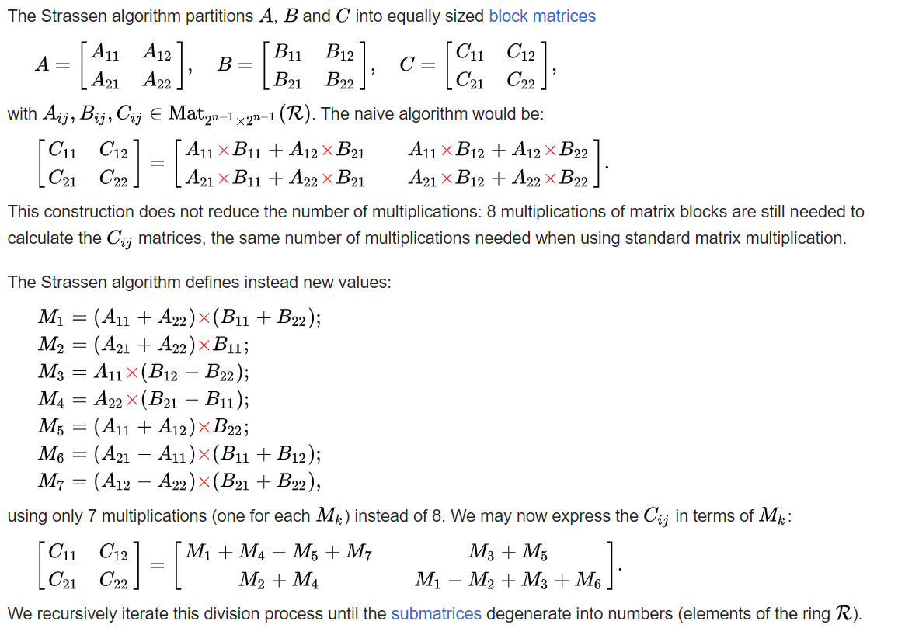

Linear Algebra
==============

Linear algebra is a cornerstone of modern mathematics, providing a framework for understanding and solving a wide range of problems in various fields, from physics and engineering to computer science and economics.

Applications:
- Physics: Describing forces, analyzing electrical circuits, and modeling quantum mechanics.   
- Computer Graphics: Representing images, performing transformations (rotations, scaling), and rendering 3D graphics.   
- Machine Learning: Representing data, training models, and making predictions.   
- Economics: Modeling economic systems, analyzing market trends, and forecasting.   

All linear algebra functionalities can be accessed through vector and matrices in the mathematics library. 
In essence, matrices provide a versatile and elegant framework for representing and manipulating data, making them an indispensable tool in various fields of science, engineering, and technology.

Matrix Slicing
--------------
Slicing is a powerful feature in CCL-Math that allows you to extract specific portions of arrays. Slicing can be applied along multiple axes, enabling efficient data manipulation and analysis.
To illustrate the power of Matrix slicing lets see how to implement strassen multiplication in with CCL-Math. 

Strassen’s algorithm is a method for matrix multiplication that is more efficient than the standard algorithm for large matrices. It was developed by Volker Strassen in 1969. The key idea is to reduce the number of multiplications needed to compute the product of two matrices.

In the standard matrix multiplication, multiplying two (2 \times 2) matrices requires 8 multiplications. Strassen’s algorithm reduces this to 7 multiplications by using a divide-and-conquer approach. Here’s a simplified outline of the process:

 #. Divide the matrices into four submatrices.
 #. Compute seven products using combinations of these submatrices.
 #. Combine these products to get the final result.

.. code-block:: C#
         
   // import libraries
   using System.Collections.Generic;
   using CypherCrescent.MathematicsLibrary;
   using static CypherCrescent.MathematicsLibrary.Math;

   static Matrix Strass(Matrix A, Matrix B)
   {
      if (A.Cols != B.Rows)   
         throw new Exception("Matrices are not conformable for multiplication");
      if (A.Cols == 1)
         return A[0, 0] * B[0, 0];
      else
      {
         // get matrix size
         int N = A.Cols / 2; Indexer I = new(0, N), J = I + N;
 
         // split A and B into submatrices
         Matrix A11 = A[I, I], A12 = A[I, J], B11 = B[I, I], B12 = B[I, J],
                A21 = A[J, I], A22 = A[J, J], B21 = B[J, I], B22 = B[J, J],
 
         // compute the strassen submatrices (7 multiplication)
             M1 = Strass(A11 + A22, B11 + B22),
             M2 = Strass(A21 + A22, B11),
             M3 = Strass(A11, B12 - B22),
             M4 = Strass(A22, B21 - B11),
             M5 = Strass(A11 + A12, B22),
             M6 = Strass(A21 - A11, B11 + B12),
             M7 = Strass(A12 - A22, B21 + B22);
 
         // compose the result
         return new Matrix[,] 
         { 
             { M1 + M4 - M5 + M7,        M3 + M5      },
             {      M2 + M4,        M1 - M2 + M3 + M6 } 
         };
      } 
   }

   Matrix A = Rand(8,8), B = Rand(8,8), C = Strass(A, B);
   Console.WriteLine($"A = \n{A}");
   Console.WriteLine($"B = \n{B}");
   Console.WriteLine($"C = \n{C}");

Output

.. code-block:: C#

   A =
   
      0.0420    0.4994    0.5743    0.4063    0.8953    0.3763    0.2733    0.8076
      0.2540    0.0520    0.1481    0.1711    0.6749    0.6646    0.6933    0.0637
      0.5008    0.4837    0.2862    0.5715    0.4720    0.3059    0.1932    0.1188
      0.7239    0.9512    0.3074    0.4888    0.2878    0.8938    0.2250    0.2153
      0.6737    0.3165    0.8803    0.7742    0.2817    0.9368    0.1121    0.2495
      0.4956    0.5816    0.4635    0.3508    0.1191    0.1055    0.1149    0.4786
      0.8214    0.1806    0.0344    0.2528    0.4501    0.0204    0.6514    0.7361
      0.3061    0.4554    0.6824    0.9441    0.0689    0.7845    0.5199    0.3602
   
   B =
   
      0.8270    0.9327    0.4975    0.3583    0.7843    0.9191    0.7820    0.5640
      0.3716    0.0367    0.0759    0.8905    0.8424    0.8424    0.9997    0.6184
      0.8363    0.8289    0.6674    0.1071    0.8594    0.9722    0.7652    0.6533
      0.6651    0.1442    0.4681    0.8262    0.2544    0.1680    0.1806    0.7110
      0.0617    0.1034    0.5238    0.1864    0.6080    0.7566    0.6943    0.9024
      0.3986    0.4704    0.8811    0.4135    0.9444    0.7610    0.8937    0.4637
      0.4557    0.0640    0.1078    0.2400    0.1171    0.4127    0.5008    0.8548
      0.1676    0.8441    0.6932    0.6401    0.4509    0.9558    0.3097    0.2037
   
   C =
   
      1.4360    1.5609    2.0221    1.7619    2.3464    2.9343    2.3897    2.3771
      1.1002    0.8667    1.3672    0.9023    1.5617    1.8133    1.8242    1.9166
      1.4725    1.1099    1.3644    1.4499    1.8437    2.0253    1.9321    1.9321
      2.0471    1.6818    1.9781    2.1582    2.9001    3.0441    3.0185    2.4553
      2.4096    2.1688    2.4671    1.8837    2.9301    3.0824    2.8228    2.5366
      1.4290    1.3917    1.2638    1.4347    1.7675    2.1302    1.7697    1.5436
      1.3995    1.5569    1.3978    1.3875    1.5914    2.3115    1.7798    1.8996
      2.2354    1.7175    2.1173    2.0609    2.4565    2.6950    2.5082    2.5151
   
  

