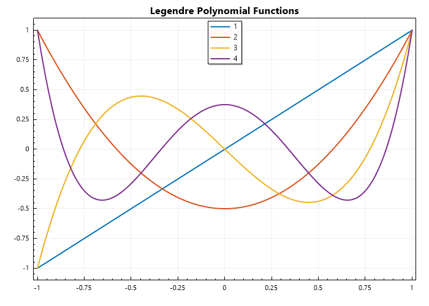
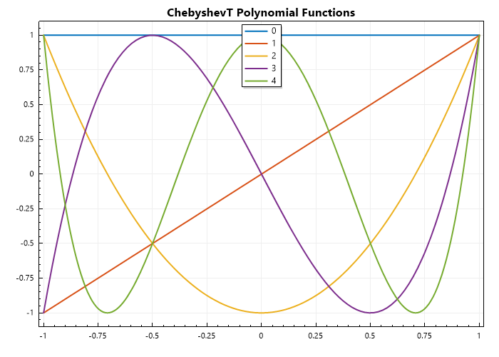
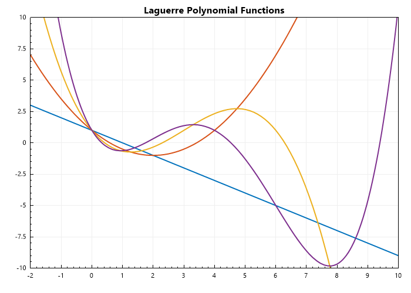
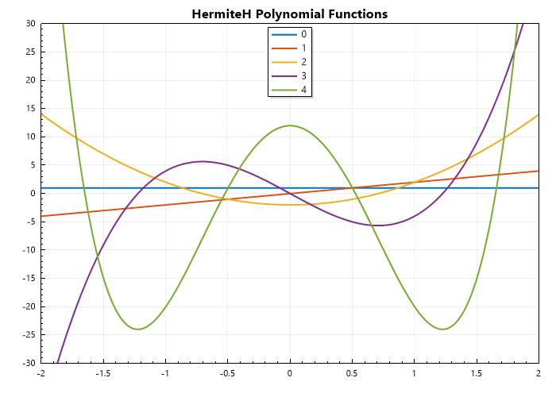

Special Functions
#################

In the realm of mathematics, we encounter a vast array of functions, from the simple linear functions to the intricate complexities of calculus. Among these, a special class of functions emerges, known as special functions. These are not your everyday polynomials or trigonometric functions; they arise naturally in various branches of mathematics, physics, and engineering, often as solutions to differential equations or integrals that defy elementary solutions.   

Key Characteristics:

- Non-Elementary: Special functions cannot be expressed in terms of simple combinations of elementary functions like polynomials, exponentials, logarithms, or trigonometric functions.
- Ubiquitous in Applications: They appear frequently in diverse fields:
- Physics: Describing phenomena in quantum mechanics, electromagnetism, and fluid dynamics.   
- Engineering: Solving problems in signal processing, control theory, and heat transfer.   
- Mathematics: Arising in number theory, combinatorics, and complex analysis.   
  
Examples of Special Functions:

- Gamma Function: A generalization of the factorial function to real and complex numbers.   
- Bessel Functions: Solutions to Bessel's differential equation, crucial in problems involving cylindrical symmetry (e.g., vibrations of drums, wave propagation in cylindrical structures).
- Legendre Polynomials: Solutions to Legendre's differential equation, fundamental in potential theory and spherical harmonics.   
- Error Function: Describes the probability of finding a normally distributed random variable within a certain range.   
- Elliptic Integrals: Arise in the calculation of arc lengths of ellipses and other geometric problems.

   
Bessel Functions
****************

Bessel functions are a family of solutions to Bessel's differential equation, which appears in many physical problems involving cylindrical or spherical symmetry. They are named after the German mathematician Friedrich Wilhelm Bessel, who first studied them in the early 19th century.

Bessel's Differential Equation
==============================
The general form of Bessel's differential equation is:

.. math::

   x^2 \frac{d^2y}{dx^2} + x\frac{dy}{dx} + (x^2 - n^2)y = 0

where :math:`n`  is a parameter that determines the order of the Bessel function.

Types of Bessel Functions
=========================
#. **Bessel Functions of the First Kind** :math:`(J_n(x))` These functions are denoted by :math:`(J_n(x))` and are solutions to Bessel's differential equation that are finite at the origin (for non-negative integer orders). They are commonly used in problems involving wave propagation, static potentials and flow in porous media.

    .. math::
    
       J_n(x) = \sum_{m = 0}^{\infty} \frac{(-1)^m}{m!\Gamma(m+n+1)}\left(\frac{x}{2}\right)^{2m + n}

#. **Bessel Functions of the Second  Kind** :math:`(Y_n(x))` These functions are denoted by :math:`(Y_n(x))`,  are also solutions to Bessel's differential equation but have a singularity at the origin. They are often used in conjunction with :math:`(J_n(x))`  to form a complete set of solutions.

    .. math::
    
       Y_n(x) = \frac{J_n(x)\cos(n\pi) - J_{-n}(x)}{\sin(n\pi)}

#. **Modified Bessel Functions (** :math:`I_n(x)` **and** :math:`K_n(x)` **)**: These functions are solutions to the modified Bessel's differential equation, which is obtained by replacing  :math:`x` with :math:`ix` in the original equation. They are used in problems involving heat conduction and diffusion.

    .. math::
    
       I_n(x) = \sum_{m = 0}^{\infty} \frac{1}{m!\Gamma(m+n+1)}\left(\frac{x}{2}\right)^{2m + n}
    .. math::
    
       K_n(x) = \frac{\pi}{2}\frac{I_{-n}(x) - I_n(x)}{\sin(n\pi)}
    
.. code-block:: C#

   // import libraries
   using System;
   using CypherCrescent.MathematicsLibrary;
   using static CypherCrescent.MathematicsLibrary.Math;

   ColVec x = Linspace(0, 10);
   Indexer Z = new(0, 8);
   Matrix J = Z.Select(z => BesselJ(z, x)).ToList();
   Plot(x, J, Linewidth: 2);
   Title("Bessel Functions");
   Legend(Z.Select(z => z.ToString()), Alignment.UpperRight);
   SaveAs("BesselJ-Functions.png");

Output: 
      
.. figure:: images/BesselJ-Functions.png
   :align: center
   :alt: BesselJ-Functions.png

.. math::

   Q_n(z) = \frac{\sqrt{\pi} \Gamma(n+1)}{2^{n+1} \Gamma(n+\frac{3}{2})} \left( \frac{z^2-1}{z} \right)^{n/2} \, _2F_1\left( \frac{n+1}{2}, \frac{n+2}{2}; n+\frac{3}{2}; \frac{1}{z^2} \right)

.. code-block:: C#

   // import libraries
   using System;
   using CypherCrescent.MathematicsLibrary;
   using static CypherCrescent.MathematicsLibrary.Math;

   ColVec x = Linspace(-1, 1);
   Indexer Z = new(1, 5);
   Matrix P = Z.Select(z => Legendre(z, x)).ToList();
   Plot(x, P, Linewidth: 2);
   Title("Legendre Polynomial Functions");
   Legend(Z.Select(z => z.ToString()), Alignment.UpperCenter);
   SaveAs("Legendre-Polynomial-Functions.png");

Output: 
      

.. code-block:: C#

   // import libraries
   using System;
   using CypherCrescent.MathematicsLibrary;
   using static CypherCrescent.MathematicsLibrary.Math;

   ColVec x = Linspace(-1, 1);
   Indexer Z = new(0, 5);
   Matrix T = Z.Select(z => ChebyshevT(z, x)).ToList();
   Plot(x, T, Linewidth: 2);
   Title("ChebyshevT Polynomial Functions");
   Legend(Z.Select(z => z.ToString()), Alignment.UpperCenter);
   SaveAs("ChebyshevT-Polynomial-Functions.png");

Output: 
      

.. code-block:: C#

   // import libraries
   using System;
   using CypherCrescent.MathematicsLibrary;
   using static CypherCrescent.MathematicsLibrary.Math;

   ColVec x = Linspace(-1, 1);
   Indexer Z = new(0, 5);
   Matrix T = Z.Select(z => ChebyshevT(z, x)).ToList();
   Plot(x, T, Linewidth: 2);
   Title("ChebyshevU Polynomial Functions");
   Legend(Z.Select(z => z.ToString()), Alignment.UpperCenter);
   SaveAs("ChebyshevU-Polynomial-Functions.png");

Output: 
      
.. figure:: images/ChebyshevU-Polynomial-Functions.png
   :align: center
   :alt: ChebyshevU-Polynomial-Functions.png

.. code-block:: C#

   // import libraries
   using System;
   using CypherCrescent.MathematicsLibrary;
   using static CypherCrescent.MathematicsLibrary.Math;

   ColVec x = Linspace(-2, 10);
   Indexer Z = new(1, 5);
   Matrix P = Z.Select(z => Laguerre(z, x)).ToList();
   Plot(x, P, Linewidth: 2);
   Title("Laguerre Polynomial Functions");
   Axis([-2, 10, -10, 10]);
   Legend(Z.Select(z => z.ToString()), Alignment.UpperCenter);
   SaveAs("Laguerre-Polynomial-Functions.png");

Output: 
      

.. code-block:: C#

   // import libraries
   using System;
   using CypherCrescent.MathematicsLibrary;
   using static CypherCrescent.MathematicsLibrary.Math;

   ColVec x = Linspace(-2, 2);
   Indexer Z = new(0, 5);
   Matrix T = Z.Select(z => Hermite(z, x)).ToList();
   Plot(x, T, Linewidth: 2);
   Title("HermiteH Polynomial Functions");
   Axis([-2, 2, -30, 30]);
   Legend(Z.Select(z => z.ToString()), Alignment.UpperCenter);
   SaveAs("HermiteH-Polynomial-Functions.png");

Output: 
      
