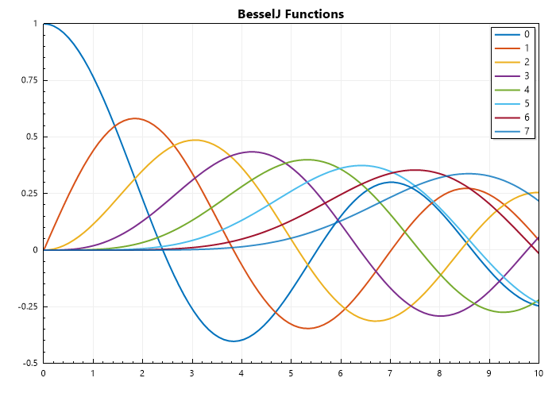
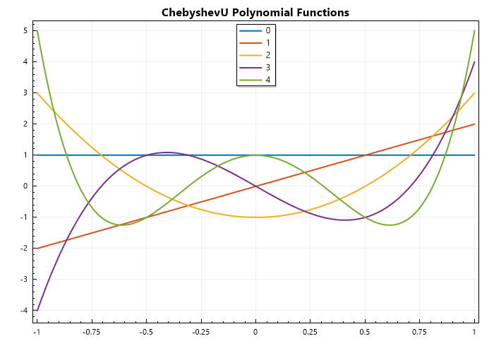
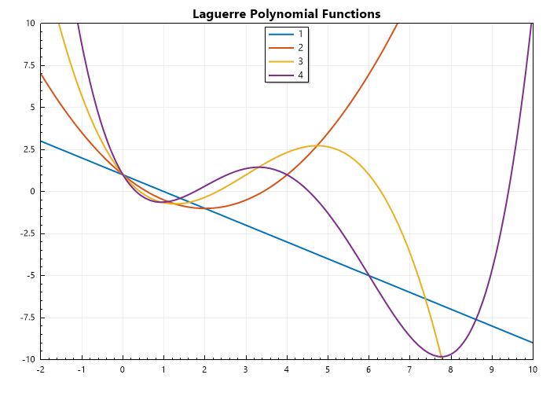

Special Functions
=================

In the realm of mathematics, we encounter a vast array of functions, from the simple linear functions to the intricate complexities of calculus. Among these, a special class of functions emerges, known as special functions. These are not your everyday polynomials or trigonometric functions; they arise naturally in various branches of mathematics, physics, and engineering, often as solutions to differential equations or integrals that defy elementary solutions.   

Key Characteristics:

- Non-Elementary: Special functions cannot be expressed in terms of simple combinations of elementary functions like polynomials, exponentials, logarithms, or trigonometric functions.
- Ubiquitous in Applications: They appear frequently in diverse fields:
- Physics: Describing phenomena in quantum mechanics, electromagnetism, and fluid dynamics.   
- Engineering: Solving problems in signal processing, control theory, and heat transfer.   
- Mathematics: Arising in number theory, combinatorics, and complex analysis.   
  
Examples of Special Functions:

- Gamma Function: A generalization of the factorial function to real and complex numbers.   
- Bessel Functions: Solutions to Bessel's differential equation, crucial in problems involving cylindrical symmetry (e.g., vibrations of drums, wave propagation in cylindrical structures).
- Legendre Polynomials: Solutions to Legendre's differential equation, fundamental in potential theory and spherical harmonics.   
- Error Function: Describes the probability of finding a normally distributed random variable within a certain range.   
- Elliptic Integrals: Arise in the calculation of arc lengths of ellipses and other geometric problems.

   
.. code-block:: C#

   // import libraries
   using System;
   using CypherCrescent.MathematicsLibrary;
   using static CypherCrescent.MathematicsLibrary.Math;

   ColVec x = Linspace(0, 10);
   Indexer Z = new(0, 8);
   Matrix J = Z.Select(z => BesselJ(z, x)).ToList();
   Plot(x, J, Linewidth: 2);
   Title("Bessel Functions");
   SaveAs("BesselJ-Functions.png");

Output: 
      

.. code-block:: C#

   // import libraries
   using System;
   using CypherCrescent.MathematicsLibrary;
   using static CypherCrescent.MathematicsLibrary.Math;

   ColVec x = Linspace(-1, 1);
   Indexer Z = new(0, 8);
   Matrix P = Z.Select(z => Legendre(z, x)).ToList();
   Plot(x, P, Linewidth: 2);
   Title("Legendre Polynomial Functions");
   SaveAs("Legendre-Polynomial-Functions.png");

Output: 
      
.. figure:: images/Legendre-Polynomial-Functions.png
   :align: center
   :alt: Legendre-Polynomial-Functions.png

.. code-block:: C#

   // import libraries
   using System;
   using CypherCrescent.MathematicsLibrary;
   using static CypherCrescent.MathematicsLibrary.Math;

   ColVec x = Linspace(-1, 1);
   Indexer Z = new(0, 8);
   Matrix T = Z.Select(z => ChebyshevT(z, x)).ToList();
   Plot(x, T, Linewidth: 2);
   Title("ChebyshevT Polynomial Functions");
   SaveAs("ChebyshevT-Polynomial-Functions.png");

Output: 
      
.. figure:: images/ChebyshevT-Polynomial-Functions.png
   :align: center
   :alt: ChebyshevT-Polynomial-Functions.png

.. code-block:: C#

   // import libraries
   using System;
   using CypherCrescent.MathematicsLibrary;
   using static CypherCrescent.MathematicsLibrary.Math;

   ColVec x = Linspace(-1, 1);
   Indexer Z = new(0, 8);
   Matrix U = Z.Select(z => ChebyshevT(z, x)).ToList();
   Plot(x, U, Linewidth: 2);
   Title("ChebyshevU Polynomial Functions");
   SaveAs("ChebyshevU-Polynomial-Functions.png");

Output: 
      

.. code-block:: C#

   // import libraries
   using System;
   using CypherCrescent.MathematicsLibrary;
   using static CypherCrescent.MathematicsLibrary.Math;

   ColVec x = Linspace(-2, 10);
   Indexer Z = new(1, 5);
   Matrix P = Z.Select(z => Laguerre(z, x)).ToList();
   Plot(x, P, Linewidth: 2);
   Title("Laguerre Polynomial Functions");
   Axis([-2, 10, -10, 10]);
   SaveAs("Laguerre-Polynomial-Functions.png");

Output: 
      
